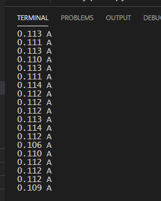
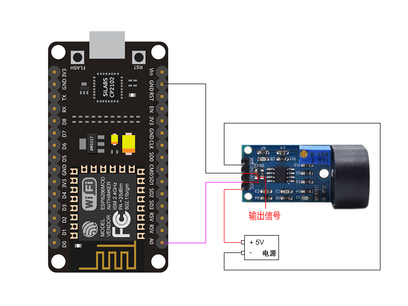

# esp8266-zmct103c
It is best solution for the signal acquisition of AC current within 5A range.

使用esp8266 + zmct103c交流互感器(模拟信号) 测量电流

## 效果

## 连线

| zmct103c    | ESP8266 | 5V直流电源 |
| ----------- | ------- | ---------- |
| -(电源) GND |         | - 负极     |
| GND         | GND     |            |
| OUT         | A0      |            |
| +(电源) VCC |         | + 正极     |

